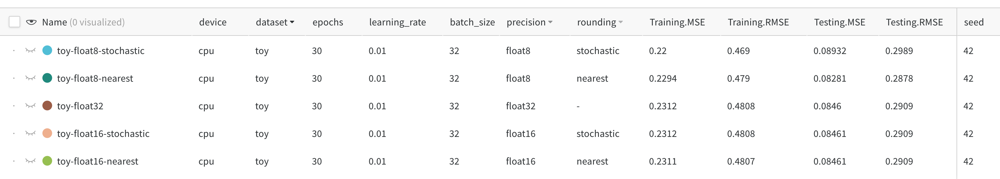
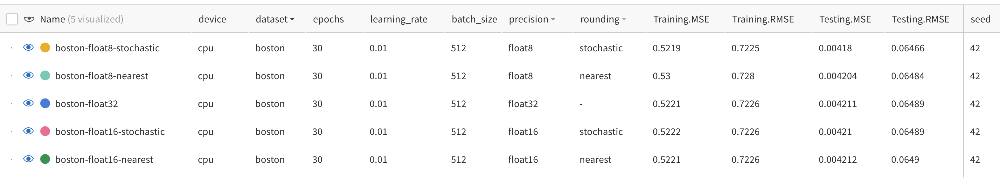
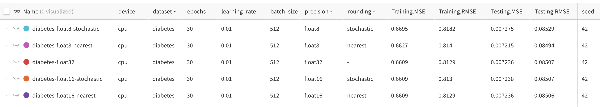

# low_precision_ml
 
## Setup

```
conda env create -f environment.yml  
conda activate low-precision-ml
```

## Running the training script
`python main.py --[args]`

Arguments:
* `dataset`: choose one of `toy`, `diabetes`, or `boston`
* `epochs`: number of epochs, default=`2`
* `learning-rate`: learning rate for SGD, default=`0.01`
* `batch-size`: batch size for minibatch SGD, default=`256`
* `test-split`: train/test split, default=`0.2`
* `precision`: floating point precision. choose one of `float32`, `float16`, or `float8`, default=`0.2`
* `rounding`: if `precision` is `float16` or `float8`, choose `nearest` or `stochastic`, default=`nearest`
* `seed`: random seed/random state for reproducibility, default=`42`

## Before you run the script
Go to `train.py`. Make sure that in the following code line has **YOUR wandb project and entity info**.
```python
def model_pipeline(config) -> nn.Module:
    # tell wandb to get started
    with wandb.init(project="low-precision-ml", entity="simonbenigeri", config=config):
        # access all HPs through wandb.config, so logging matches execution!
        config = wandb.config
        ...
```

## Reproducing our experiments

### `toy` dataset
Toy dataset is a straight line.

|Dataset name| toy |
| --- | ----------- |
| Samples  total | 11 |
| Dimensionality | 1 |
| Features| integer, [1, 11] |
| Targets | integer, y = 2x + 1 |

We ran the following commands:
```python
python main.py --dataset toy --epochs 30 --learning-rate 0.01 --batch-size 32 --precision float8 --rounding nearest --seed 42
python main.py --dataset toy --epochs 30 --learning-rate 0.01 --batch-size 32 --precision float8 --rounding stochastic --seed 42
python main.py --dataset toy --epochs 30 --learning-rate 0.01 --batch-size 32 --precision float16 --rounding nearest --seed 42
python main.py --dataset toy --epochs 30 --learning-rate 0.01 --batch-size 32 --precision float16 --rounding stochastic --seed 42
python main.py --dataset toy --epochs 30 --learning-rate 0.01 --batch-size 32 --precision float32 --seed 42
```

#### Results:



### `boston` dataset
This dataset is the scikit-learn [boston housing prices dataset](https://scikit-learn.org/stable/modules/generated/sklearn.datasets.load_boston.html).

|Dataset name| boston |
| --- | ----------- |
| Samples  total | 506 |
| Dimensionality | 13 |
| Features | real, positive |
| Samples  total | real 5. - 50.|

We ran the following commands:
```python
python main.py --dataset boston --epochs 30 --learning-rate 0.01 --batch-size 512 --precision float8 --rounding nearest --seed 42
python main.py --dataset boston --epochs 30 --learning-rate 0.01 --batch-size 512 --precision float8 --rounding stochastic --seed 42
python main.py --dataset boston --epochs 30 --learning-rate 0.01 --batch-size 512 --precision float16 --rounding nearest --seed 42
python main.py --dataset boston --epochs 30 --learning-rate 0.01 --batch-size 512 --precision float16 --rounding stochastic --seed 42
python main.py --dataset boston --epochs 30 --learning-rate 0.01 --batch-size 512 --precision float32 --seed 42
```

#### Results:


### `diabetes` dataset
Diabetes dataset is the scikit-learn diabetes dataset.

|Dataset name| diabetes |
| --- | ----------- |
| Samples  total | 442 |
| Dimensionality | 10 |
| Features| real, -.2 < x < .2 |
| Targets | integer 25 - 346 |

We ran the following commands:
```python
python main.py --dataset diabetes --epochs 30 --learning-rate 0.01 --batch-size 512 --precision float8 --rounding nearest --seed 42
python main.py --dataset diabetes --epochs 30 --learning-rate 0.01 --batch-size 512 --precision float8 --rounding stochastic --seed 42
python main.py --dataset diabetes --epochs 30 --learning-rate 0.01 --batch-size 512 --precision float16 --rounding nearest --seed 42
python main.py --dataset diabetes --epochs 30 --learning-rate 0.01 --batch-size 512 --precision float16 --rounding stochastic --seed 42
python main.py --dataset diabetes --epochs 30 --learning-rate 0.01 --batch-size 512 --precision float32 --seed 42
```

#### Results:



### `cifar10` dataset
CIFAR10 dataset

#### Results:

## Writeup

### Background
